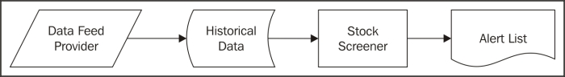
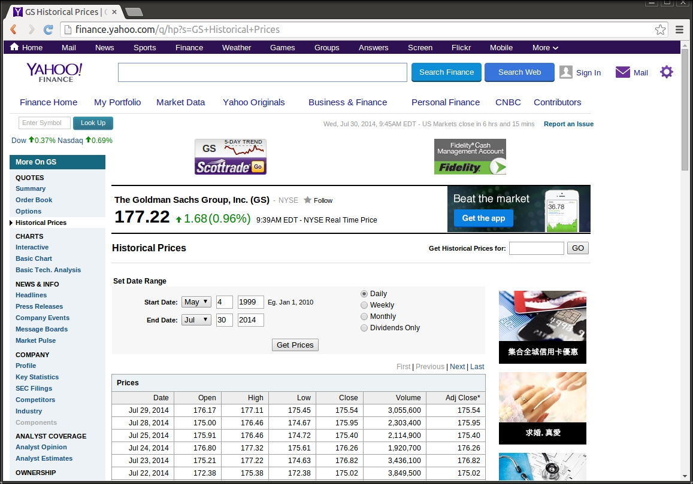
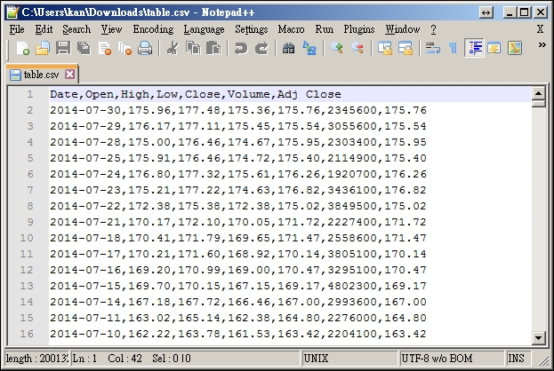
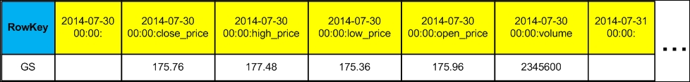
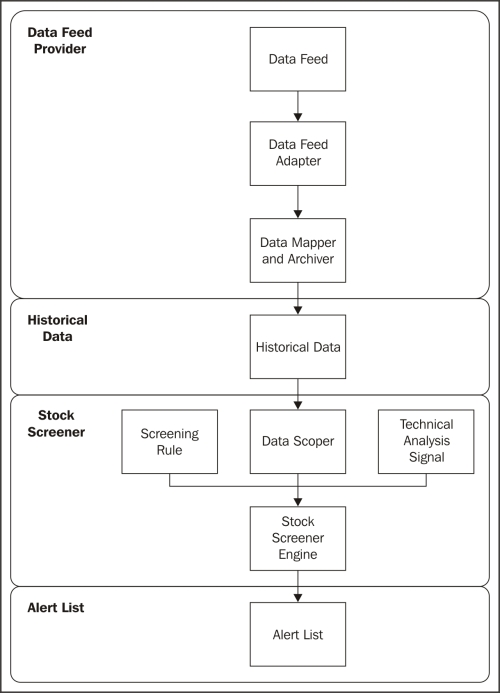
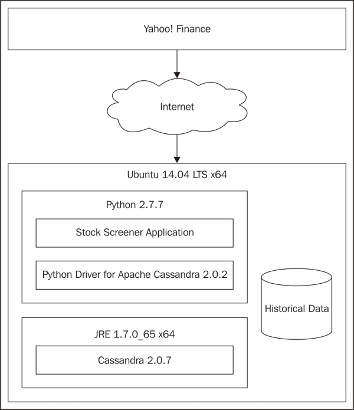
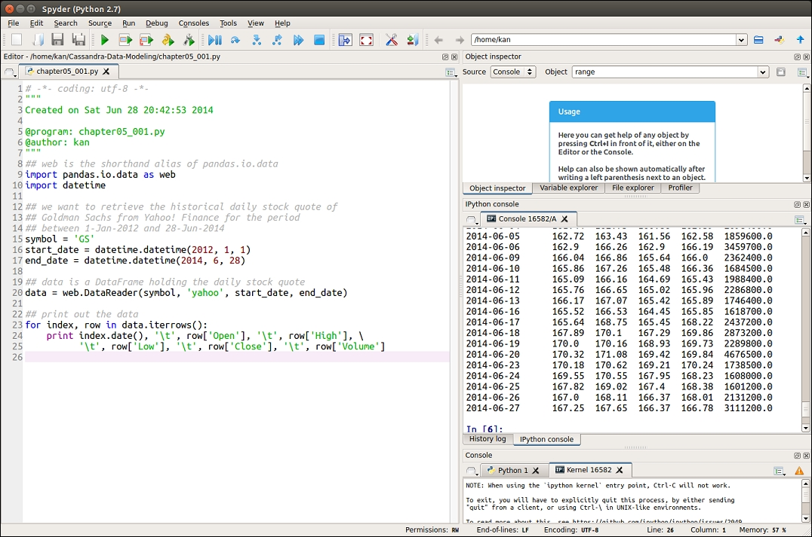
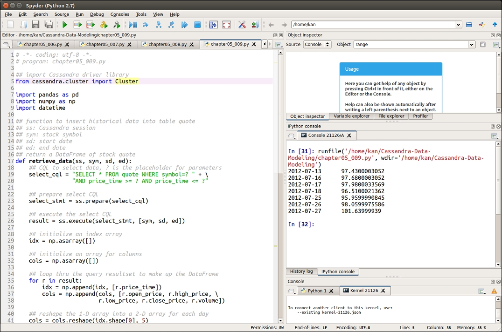

Chapter 5. First-cut Design and Implementation
-------------------------------------------------------


Riding on the ingredients of a Cassandra data model that were explained
in the previous chapters, now it is time to put them into a working
application. We will begin defining what we really want to store and
inquire in the data model, setting up the environment, writing the
program code, and finally testing the application.

The application to be built is a Stock Screener
Application, which stores the historical stock quotes in a Cassandra
database for technical analysis. The application collects the stock
quote data from a free source on the Internet and then applies some
technical analysis indicators to find out the buy and sell reference
signals. A brief and quick introduction of technical analysis is given
in order to enable you to easily understand what the application does.
Although it is oversimplified in architecture and not complete in
features, it does provide a good foundation for further improvement on
more advanced features to be made by you.


### Note

**Disclaimer**

It should be assumed that the methods, techniques, or indicators
discussed in this book will be profitable and will not result in losses.
There is no assurance that the strategies and methods presented will be
successful, or that you will become a profitable trader. The past
performance and results of any trading system or trading methodology are
not necessarily indicative of future results. You should not trade with
money that you cannot afford to lose. The examples discussed and
presented in this book are for educational purposes only. These are not
solicitations of any order to buy or sell. I assume no responsibility
for your trading results. No representation is being made that any
account will, or is likely to, achieve profits or losses similar to
those discussed in this book. There is a very high degree of risk in
trading. You are encouraged to consult a certified financial advisor
before making any investment or trading decisions.


Stock Screener Application
--------------------------------------------


In this section, we will learn some background
information of the sample application. Then, we will discuss the data
source, the initial data model, and the high-level processing logic of
the application.


### An introduction to financial analysis


A stock screener is a utility program that uses a
certain set of criteria to screen a large number of stocks that match
your preferences. It is akin to a search engine on stocks but not on
websites. The screening criteria might be based on
fundamental and/or technical analysis methods.

Firstly, let us look at what fundamental analysis is.


### Note

**Fundamental analysis**

Fundamental analysis  involves analyzing a
company's historical and present financial statements and health, its
management and competitive advantages, and its competitors and markets,
in order to assess and calculate the value of a company stock and
predict its probable price evolution. The goal is to make financial
forecasts and find out the undervalued stock (stock that is cheap, in
other words) for buy-and-hold.
:::

In contrast, technical analysis is a totally different approach.


### Note

**Technical analysis**

Technical analysis is  a stock analysis methodology
used to forecast the direction of prices through the study of past
market data, primarily price and volume. The fundamental principle of
technical analysis is that the market price reflects all the relevant
information, so the analysis looks at the history of the trading
patterns rather than external drivers such as economic, fundamental, and
news events.
:::

In this book, technical analysis is solely used for the Stock Screener
Application. As technical analysis focuses on price actions, the Stock
Screener Application requires stock price data as its input and then it
applies technical analysis techniques to determine whether the stock
fulfills the buy or sell conditions. Whenever such a condition is
fulfilled, we can say that a trading signal is triggered.

The conceptual design of the Stock Screener Application is shown in the
following figure:




We will go through the  preceding figure from the
left to the right. **Data Feed Provider** is the source of
stock quote data that is collected from a free Data Feed
 Provider on the Internet, such as Yahoo! Finance. It should
be noted that Yahoo! Finance provides free-of-charge
**end-of-day** (**EOD**) 
stock quote data, thus providing the daily stock quote. If
you want the  **Stock Screener** to
produce intraday signals, you need to look for other Data Feed Providers
who typically have a wide range of paid service offers available.
**Historical Data** is a repository to
store the historical stock quote data. **Stock Screener** is
the application to be developed in this chapter. Lastly, **Alert
List** is  a list of trading signals found
by the **Stock Screener**.

Before we proceed to the high-level design of the **Stock
Screener**, I would like to highlight the reasons of
establishing the **Historical Data** repository. There are
three major reasons. First, it can save tremendous network bandwidth
from repeatedly downloading historical stock quote data from the Data
Feed Provider (actually, Yahoo! Finance provides as many as 10 years of
historical price data.) Second, it serves as a canonical data model so
that the **Stock Screener** does not need to cater for the
different data formats of different Data Feed Providers. Finally, the
**Stock Screener** can still perform technical analysis on
the historical data even though it is disconnected from the Internet.


### Stock quote data


Technical analysis only focuses on price action. So
what is price action? Price action is simply the movement of a stock's
price. It is encompassed in technical and chart
pattern analysis in an attempt to discover the order in the seemingly
random movement of price.

On a single day, the price action of a stock can be summarized by four
important prices:


-   **Open price**: This is the starting
    price for that day

-   **High price**: This is the highest 
    price for that day

-   **Low price**: This is the lowest price
     for that day

-   **Close price**: This is the  closing
    price for that day
:::

These four prices are usually abbreviated as OHLC. In addition to OHLC,
another measure of how much of a given stock has been traded in a given
period of time is known as Volume. For a complete
trading day, the volume is called daily volume.

Only five attributes such as **open price**, **high
price**, **low price**, **close price**,
and **volume** (**OHLCV**), provide all the
necessary and sufficient data for technical
analysis of stock. Now we know the input for technical analysis, but how
do we get them?

Many websites provide free-of-charge stock quote
data that are very easy to obtain, and are especially suitable for
amateur or retail traders. The following websites
are just a few of them listed for your reference:


-   Yahoo! Finance:
    [http://finance.yahoo.com](http://finance.yahoo.com/){.ulink}

-   Google Finance:
    <https://www.google.com/finance>

-   EODData: [http://eoddata.com](http://eoddata.com/){.ulink}
:::

However, there is a caveat that stock quote data might have errors, for
example, incorrect high and low prices. In this book, I selected Yahoo!
Finance as the prime Data Feed Provider. The following screenshot is a
sample of the historical prices of a stock called *GS*:




As you scroll to the  bottom of the web page,
you will see a link *Download to
Spreadsheet*. When you click on this link, the historical
stock quote data can be downloaded as a 
 **Comma Separated Values** (**CSV**)
file. An excerpt of the CSV file is shown in the following screenshot:




Of course, we can manually download the historical
stock quote data from the website. Nonetheless, it becomes impractical
when we want to download the data of many different
stocks on a daily basis. Thus, we will develop a program to 
automatically collect the data feed.


### Initial data model


We now know that a single daily price action consists of a stock symbol,
trading date, open price, high price, low price, close price, and
volume. Obviously, a sequence of price action measured
typically at successive trading days is of a
time-series nature and Cassandra is very suitable for storing
time-series type data.

As mentioned previously, it is beneficial to store
the collected stock quote data locally in a
repository. Therefore, we will implement the repository as a table in a
Cassandra database.

We can use CQL to define a table called `quote` to store the
historical prices:


``` {.programlisting .language-markup}
// table to store historical stock quote data
CREATE TABLE quote (
  symbol varchar, // stock symbol
  price_time timestamp, // timestamp of quote
  open_price float, // open price
  high_price float, // high price
  low_price float, // low price
  close_price float, // close price
  volume double, // volume
  PRIMARY KEY (symbol, price_time) // primary key
);
```
:::

The column data types and names are
self-explanatory.

One useful technique of designing a Cassandra data
model is to imagine the  visual representation of
the internal storage of a row. The following figure is such an example:




Based on the design of the primary key, the row key is
`symbol` and the clustering column is `price_time`.
It is expected that a row will become a wide row, as more historical
stock quote data gets added to it. Without the internal storage picture,
this might not be easy to spot in the initial data model design stage.
For the time being, we just take note of the potential wide row problem
and leave it as is (one possible solution is the date bucket pattern).


### Processing flow


The following figure shows the processing
flow of the **Stock Screener**, which
elaborates the conceptual design with a more detailed sequence of steps.
Each of the building blocks is explained starting first from the top, as
shown in the following screenshot:




**Data Feed Provider** consists of
**Data Feed**, **Data Feed Adapter**, and
 **Data Mapper and Archiver**. Yahoo!
Finance is chosen as the data feed. **Data Feed
Adapter** is used to deal with the
different connectivity and interfacing methods if
we switch to other Data Feed
Providers. **Data Mapper and Archiver** caters for the
different stock quote data formats and standardizes them to the
corresponding columns of the `quote` table.

The `quote` table is the **Historical Data**
repository and has been explained previously.

We now turn our focus to the core **Stock Screener**. The
heart of the **Stock Screener** is the 
**Stock Screener Engine** that uses the 
**Screening Rule** on the **Historical Data**,
which is filtered by the **Data
Scoper**. The **Screen Rule** is 
 used by one or more **Technical Analysis
Signals** so that the **Stock Screener
Engine** produces an alert if the conditions of the
**Technical Analysis Signals** are met.

The alert generated by the **Stock Screener Engine** is
presented in the form of an **Alert
List**, which can be kept as records or distributed through
other means.

Basically, the **Data Feed Provider** and the **Stock
Screener** need not run in the same process. They work in an
asynchronous mode. This means that the **Data Feed Provider**
can collect, map, and archive the historical stock quote data into the
**Historical Data** repository, whereas the **Stock
Screener** can analyze and produce alerts independently.

We have come up with a high-level design of the
application, the next thing to do is conceivably see how it can be
implemented.


System design
-------------------------------


In this section, we will select the  appropriate
software for various system components.


### The operating system


When considering the implementation, the first
fundamental choice is the operating system. The
single most important constraint is that it must be supported by
Cassandra. For this book, I have selected Ubuntu 14.04 LTS 64-bit
Version, which can be obtained at the  official
Ubuntu website, <http://www.ubuntu.com/>. You should be able to
painlessly set up your Linux box by following the verbose installation
instructions.

However, it is entirely up to you to use any other operating systems,
supported by Cassandra, such as Microsoft Windows and Mac OS X. Please
follow the respective operating system installation instructions to set
up your machine. I have already considered the portability of the Stock
Screener. As you will see in the subsequent sections, the Stock Screener
Application is designed and developed in order to be compatible with a
great number of operating systems.


### Java Runtime Environment


As Cassandra is Java-based, a **Java Runtime
Environment** (**JRE**) is required as a
prerequisite. I have used Oracle Java SE Runtime
Environment 7 64-bit Version 1.7.0\_65. It is provided
 at the following
URL:<http://www.oracle.com/technetwork/java/javase/downloads/jre7-downloads-1880261.html>.

Of course, I have downloaded the Linux x64 binary and followed the
instructions at
<http://www.datastax.com/documentation/cassandra/2.0/cassandra/install/installJreDeb.html>
to properly set up the JRE.

At the time of writing, Java SE has been updated to Version 8. However,
I have not tested JRE 8 and DataStax recommends JRE 7 for Cassandra 2.0
too. Therefore, I will stick to JRE 7 in this book.


### Java Native Access


If you want to deploy Cassandra in production use
on Linux platforms, **Java Native Access**
(**JNA**) is required to improve Cassandra's memory usage.
When installed and configured, Linux does not swap
the  **Java virtual machine**
(**JVM**), and thus avoids any performance related issues.
This is recommended as a best practice even when Cassandra, which is to
be installed, is for non-production use.

To install JNA on Ubuntu, simply use Aptitude
Package Manager with the following command in a terminal:


``` {.programlisting .language-markup}
$ sudo apt-get install libjna-java
```
:::


### Cassandra version


I used Cassandra Version 2.0.9, which is
distributed by DataStax Community, on 
Debian or Ubuntu. The installation steps are well documented
at
<http://www.datastax.com/documentation/getting_started/doc/getting_started/gettingStartedDeb_t.html>.

The installation process typically takes several minutes depending on
your Internet bandwidth and the performance of your machine.


### Note

**DataStax**

DataStax is a computer software company based in
Santa Clara, California which offers commercial enterprise grade for
Apache Cassandra in its DataStax Enterprise product. It also provides
tremendous support for the Apache Cassandra community.
:::


### Programming language


It is now time to turn our attention to the programming language for the
implementation of the Stock Screener Application. For this book, I have
chosen Python. Python is a high-level programming language 
designed for speed of development. It is open source, free,
and cross-platform. It possesses a wealthy set of libraries for almost
every popular algorithm you can imagine.

You need not be afraid of learning Python if you
are not familiar with it. Python is designed such that it is very easy
to learn when compared to other programming languages such as C++.
Coding a Python program is pretty much like writing pseudocode that
improves the speed of development.

In addition, there are many renowned Python libraries used for data
analysis, for example, NumPy, SciPy, pandas, scikit-learn, and
matplotlib. You can make use of them to quickly build a full-blown
application with all the bells and whistles. For the Stock Screener
Application, you will use NumPy and pandas extensively.

When it comes to high performance, Python can also utilize Cython, which
is an optimizing static complier for Python programs to run as fast as
native C or C++ programs.

The latest major version of Python is Python 3. However, there are still
many programs running that are written in Python 2. This is caused by
the breaking backward compatibility of Python 3 that makes the migration
of so many libraries written in Python 2 to Python 3, a very long way to
go. Hence, the coexistence of Python 2 and Python 3 is expected for
quite a long time in future. For this book, Python 2.7.x is used.

The following steps are used to install Python 2.7
in Ubuntu using a terminal:


``` {.programlisting .language-markup}
$ sudo apt-get –y update
$ sudo apt-get –y upgrade
$ sudo apt-get install python-pip python-dev \
$ python2.7-dev build-essential
```
:::

Once the installation is complete, type the following command:


``` {.programlisting .language-markup}
$ python --version
```
:::

You should see the version string returned by Python, which tells you
that the installation has been successful.

One problem that many Python beginners face is the cumbersome
installation of the various library packages. To rectify this problem, I
suggest that the reader downloads the Anaconda distribution. Anaconda is
completely free and includes almost 200 of the most popular Python
packages for Science, Mathematics, engineering, and data analysis.
Although it is  rather bulky in size, it frees you
from the Python package hustle. Anaconda can be
downloaded at <http://continuum.io/downloads>, where you can select the
appropriate versions of Python and the operating
system. It is straightforward to install Anaconda by following the
installation instructions, so I will not detail the steps here.


### Cassandra driver


The last item of the system environment is the
driver software for Python to connect to a Cassandra database. In fact,
there are several choices out there, for example, pycassa, Cassandra
driver, and Thrift. I have chosen Python Driver 2.0
for Apache Cassandra distributed by DataStax. It exclusively supports
CQL 3 and Cassandra's new binary protocol, which was introduced in
Version 1.2. More detailed information can be found
at
<http://www.datastax.com/documentation/developer/python-driver/2.0/common/drivers/introduction/introArchOverview_c.html>.

The driver can be easily installed with pip in a Ubuntu terminal:


``` {.programlisting .language-markup}
$ pip install cassandra-driver
```

### Note

**pip**

pip is a command-line package management system
used to install and manage Python library packages. Its project page can
be found at Github, <https://github.com/pypa/pip>.
:::


### The integrated development environment


Spyder is an open source, cross-platform **integrated development
environment** (**IDE**), usually 
used for scientific programming in
Python. It is automatically installed by Anaconda and integrates NumPy,
SciPy, matplotlib, IPython, and other open source software. It is
also my favorite Python development environment.

There are many other good and popular Python IDEs, such as IPython and
Eclipse. The code in this book is friendly to these IDEs.


### The system overview


Alright, we have gone through the major system
components of the Stock Screener Application and decided their
implementation. The following figure depicts the system overview for the
implementation of the application:




It is worth noting that the system will be developed on a single Ubuntu
machine first and then on a single node Cassandra cluster,
*Deployment and Monitoring*, we will expand the
cluster to a two-node cluster). It serves as a
limit to the superb clustering capabilities of Cassandra. However, from
the software development perspective, the most important thing is to
completely realize the required functionalities rather than splitting
the significant efforts on the system or infrastructure components,
which are of second priority.


Code design and development
---------------------------------------------


We are now entering the  development stage. I will
walk you through the coding of the application
building blocks step-by-step. Logically, two core modules
 will be built, namely, Data Feed Provider and Stock
Screener. First, we will build the Data Feed Provider.


### Data Feed Provider


The Data Feed Provider achieves the following three
tasks:


1.  Collecting the historical stock quote data from Yahoo! Finance.

2.  Transforming the received data into a standardized format.

3.  Saving the standardized data into the Cassandra database.
:::

Python has a well-known data analysis library
called pandas. It is an open source library
providing high-performance, easy-to-use data structures, and data
analysis tools, especially, for time-series type of
data. You can go to <http://pandas.pydata.org/> for more details.


#### Collecting stock quote


pandas offers a `DataReader` function in its
`pandas.io.data` package. `DataReader` extracts
financial data from various Internet sources into
a data structure known as `DataFrame`.
Yahoo! Finance is one of the supported Internet sources, making the
collection of the historical stock quote data a piece of cake. Refer to
the following Python code, `chapter05_001.py`:


``` {.programlisting .language-markup}
# -*- coding: utf-8 -*-
# program: chapter05_001.py

## web is the shorthand alias of pandas.io.data
import pandas.io.data as web
import datetime

## we want to retrieve the historical daily stock quote of
## Goldman Sachs from Yahoo! Finance for the period
## between 1-Jan-2012 and 28-Jun-2014
symbol = 'GS'
start_date = datetime.datetime(2012, 1, 1)
end_date = datetime.datetime(2014, 6, 28)

## data is a DataFrame holding the daily stock quote
data = web.DataReader(symbol, 'yahoo', start_date, end_date)

## use a for-loop to print out the data
for index, row in data.iterrows():
    print index.date(), '\t', row['Open'], '\t', row['High'], \
          '\t', row['Low'], '\t', row['Close'], '\t', row['Volume']
```
:::

A brief explanation is required. pandas offers a very handy data
structure called `DataFrame` , which is a two-dimensional
labeled data structure with columns of potentially different
 types. You can think of it as a spreadsheet or SQL table. It
is generally the most commonly used pandas object.

The following is a screenshot demonstrating the use of Spyder to write
and test `chapter05_001.py` code:




The left-hand side of the Spyder IDE is the place where you write Python
code. The middle panel on the right-hand side is the **IPython
console** that runs the code.


#### Transforming data


Along with the data in the `DataFrame` , you can optionally
pass index (row labels) and columns (column labels). The row and column
labels can be accessed respectively, by accessing the index and columns
attributes. For example, you can revisit the screenshot of
`table.csv` and see that the column names
returned by Yahoo! Finance are **Date**, **Open**,
**High**, **Low**, **Close**,
**Volume**, and **Adj Close**, respectively.
`DataReader` uses **Date** as the index of the
returned `DataFrame`. The remaining column names become the
column labels of the `DataFrame`.

The last for-loop in `chapter05_001.py` is also worth some
remarks. `DataFrame` has a function, `iterrows()` ,
for iterating over its rows as (index, columns)
pairs. Therefore, the for-loop uses `iterrows()` to iterate
the daily stock quotes and we simply print out the index (that is
converted to a string by the `date()` function), and the
**Open**, **High**, **Low**,
**Close**, **Volume** columns by passing the
respective column labels to the row. **Adj Close** is a close
price with adjustments of stock split, merge, and dividend. We do not
use this, as we want to focus on pure prices.

Please be aware that stock quote data from the different sources might
have different formats and, needless to say, different column names.
Therefore, we need to take care of such a subtle difference, when
mapping them to our standardized data model. `DataFrame`
provides a very handy way to retrieve the data by column names and a few
useful functions to manipulate the index and columns. We can make use of
them to standardize the data format, as shown in
`chapter05_002.py`:


``` {.programlisting .language-markup}
# -*- coding: utf-8 -*-
# program: chapter05_002.py

## web is the shorthand alias of pandas.io.data
import pandas.io.data as web
import datetime

## we want to retrieve the historical daily stock quote of
## Goldman Sachs from Yahoo! Finance for the period
## between 1-Jan-2012 and 28-Jun-2014
symbol = 'GS'
start_date = datetime.datetime(2012, 1, 1)
end_date = datetime.datetime(2014, 6, 28)

## data is a DataFrame holding the daily stock quote
data = web.DataReader(symbol, 'yahoo', start_date, end_date)

## standardize the column names
## rename index column to price_date to match the Cassandra table
data.index.names=['price_date']

## drop extra column 'Adj Close'
data = data.drop(['Adj Close'], axis=1)

## rename the columns to match the respective columns in Cassandra
data = data.rename(columns={'Open':'open_price', \
                            'High':'high_price', \
                            'Low':'low_price', \
                            'Close':'close_price', \
                            'Volume':'volume'})

## use a for-loop to print out the transformed data
for index, row in data.iterrows():
    print index.date(), '\t', row['open_price'], '\t', \
                              row['high_price'], '\t', \
                              row['low_price'], '\t', \
                              row['close_price'], '\t', \
                              row['volume']
```
:::


#### Storing data in Cassandra


Before storing the retrieved data in Cassandra, we
need to create the keyspace and table in the Cassandra database. We will
create a keyspace called `fenagocdma` and
a table called `quote` in `chapter05_003.py` to hold
the Historical Data, as shown in the following
code:


``` {.programlisting .language-markup}
# -*- coding: utf-8 -*-
# program: chapter05_003.py

## import Cassandra driver library
from cassandra.cluster import Cluster

## create Cassandra instance
cluster = Cluster()

## establish Cassandra connection, using local default
session = cluster.connect()

## create keyspace fenagocdma if not exists
## currently it runs on a single-node cluster
session.execute("CREATE KEYSPACE IF NOT EXISTS fenagocdma " + \
                "WITH replication" + \
                "={'class':'SimpleStrategy', " + \
                "'replication_factor':1}")

## use fenagocdma keyspace
session.set_keyspace('fenagocdma')

## execute CQL statement to create quote table if not exists
session.execute('CREATE TABLE IF NOT EXISTS quote (' + \
                'symbol varchar,' + \
                'price_time timestamp,' + \
                'open_price float,' + \
                'high_price float,' + \
                'low_price float,' + \
                'close_price float,' + \
                'volume double,' + \
                'PRIMARY KEY (symbol, price_time))')

## close Cassandra connection
cluster.shutdown()
```
:::

The comments of the code are sufficient to explain what it is doing.
Now, we have the Historical Data repository ready
and what follows is to store the received data into it. This is exactly
the purpose of `chapter05_004.py` in
which a Python function is created to insert the
data, as shown in the following code:


``` {.programlisting .language-markup}
# -*- coding: utf-8 -*-
# program: chapter05_004.py

## import Cassandra driver library
from cassandra.cluster import Cluster
from decimal import Decimal

## function to insert historical data into table quote
## ss: Cassandra session
## sym: stock symbol
## d: standardized DataFrame containing historical data
def insert_quote(ss, sym, d):
    ## CQL to insert data, ? is the placeholder for parameters
    insert_cql = 'INSERT INTO quote (' + \
                 'symbol, price_time, open_price, high_price,' + \
                 'low_price, close_price, volume' + \
                 ') VALUES (' + \
                 '?, ?, ?, ?, ?, ?, ?' + \
                 ')'
    ## prepare the insert CQL as it will run repeatedly
    insert_stmt = ss.prepare(insert_cql)

    ## set decimal places to 4 digits
    getcontext().prec = 4

    ## loop thru the DataFrame and insert records
    for index, row in d.iterrows():
        ss.execute(insert_stmt, \
                   [sym, index, \
                   Decimal(row['open_price']), \
                   Decimal(row['high_price']), \
                   Decimal(row['low_price']), \
                   Decimal(row['close_price']), \
                   Decimal(row['volume']) \
                   ])
```
:::

Although `chapter05_004.py` contains less than ten lines of
code, it is rather complicated and needs some explanation.

We can create a function in Python using the
keyword `def`. This must be followed by the function name and
the parenthesized list of formal parameters. The
code that form the body of the function starts in
the next line, indented by a tab. Thus, in `chapter05_004.py` ,
the function name is `insert_quote()` with three parameters,
namely, `ss` , `sym` , and `d`.


### Note

**Indentation in Python**

In Python, leading whitespace (spaces and tabs) at the beginning of a
logical line is used to compute the indentation level of the line, which
in turn is used to determine the grouping of statements. Be very careful
of this. Most of the Python IDE has features to check against the
indentations. The article on the myths about indentation of Python is
worth reading, which is available at
<http://www.secnetix.de/olli/Python/block_indentation.hawk>.
:::

The second interesting thing is the `prepare()` function. It
is used to prepare CQL statements that are parsed by Cassandra and then
saved for later use. When the driver uses a prepared
 statement, it only needs to send the values of parameters to
bind. This lowers network traffic and CPU utilization as a result
of the avoidance of re-parsing the statement each
time.

The placeholders for prepared statements are
`?` characters so that the parameters are passed in sequence.
This method is called positional parameter passing.

The last segment of code is a for-loop that iterates through the
`DataFrame` and inserts each row into the quote table. We also
use the `Decimal()` function to cast the string into numeric
value.


#### Putting them all together


All pieces of Python code can be combined to make
the Data Feed Provider. To make the code cleaner, the code fragment for
the collection of stock quote is encapsulated in a function called
`collect_data()` and that for data transformation in
`transform_yahoo()` function. The complete program,
`chapter05_005.py` , is listed as follows:.


``` {.programlisting .language-markup}
# -*- coding: utf-8 -*-
# program: chapter05_005.py

## import Cassandra driver library
from cassandra.cluster import Cluster
from decimal import Decimal

## web is the shorthand alias of pandas.io.data
import pandas.io.data as web
import datetime

## function to insert historical data into table quote
## ss: Cassandra session
## sym: stock symbol
## d: standardized DataFrame containing historical data
def insert_quote(ss, sym, d):
    ## CQL to insert data, ? is the placeholder for parameters
    insert_cql = "INSERT INTO quote (" + \
                 "symbol, price_time, open_price, high_price," + \
                 "low_price, close_price, volume" + \
                 ") VALUES (" + \
                 "?, ?, ?, ?, ?, ?, ?" + \
                 ")"
    ## prepare the insert CQL as it will run repeatedly
    insert_stmt = ss.prepare(insert_cql)

    ## set decimal places to 4 digits
    getcontext().prec = 4

    ## loop thru the DataFrame and insert records
    for index, row in d.iterrows():
        ss.execute(insert_stmt, \
                   [sym, index, \
                   Decimal(row['open_price']), \
                   Decimal(row['high_price']), \
                   Decimal(row['low_price']), \
                   Decimal(row['close_price']), \
                   Decimal(row['volume']) \
                   ])

## retrieve the historical daily stock quote from Yahoo! Finance
## Parameters
## sym: stock symbol
## sd: start date
## ed: end date
def collect_data(sym, sd, ed):
    ## data is a DataFrame holding the daily stock quote
    data = web.DataReader(sym, 'yahoo', sd, ed)
    return data

## transform received data into standardized format
## Parameter
## d: DataFrame containing Yahoo! Finance stock quote
def transform_yahoo(d):
    ## drop extra column 'Adj Close'
    d1 = d.drop(['Adj Close'], axis=1)

    ## standardize the column names
    ## rename index column to price_date
    d1.index.names=['price_date']

    ## rename the columns to match the respective columns
    d1 = d1.rename(columns={'Open':'open_price', \
                            'High':'high_price', \
                            'Low':'low_price', \
                            'Close':'close_price', \
                            'Volume':'volume'})
    return d1

## create Cassandra instance
cluster = Cluster()

## establish Cassandra connection, using local default
session = cluster.connect('fenagocdma')

symbol = 'GS'
start_date = datetime.datetime(2012, 1, 1)
end_date = datetime.datetime(2014, 6, 28)

## collect data
data = collect_data(symbol, start_date, end_date)

## transform Yahoo! Finance data
data = transform_yahoo(data)

## insert historical data
insert_quote(session, symbol, data)

## close Cassandra connection
cluster.shutdown()
```

### Stock Screener


The Stock Screener retrieves historical
data from the Cassandra database 
and applies technical analysis techniques to produce alerts.
It has four components:


1.  Retrieve historical data over a specified period

2.  Program a technical analysis indicator for time-series data

3.  Apply the screening rule to the historical data

4.  Produce alert signals


#### Data Scoper


To utilize technical analysis techniques, a
sufficient optimal number of stock quote data is required for
calculation. We do not need to use all the stored data, and therefore a
subset of data should be retrieved for processing.
The following code, `chapte05_006.py` , retrieves the
historical data from the table quote within a specified period:


``` {.programlisting .language-markup}
# -*- coding: utf-8 -*-
# program: chapter05_006.py

import pandas as pd
import numpy as np

## function to insert historical data into table quote
## ss: Cassandra session
## sym: stock symbol
## sd: start date
## ed: end date
## return a DataFrame of stock quote
def retrieve_data(ss, sym, sd, ed):
    ## CQL to select data, ? is the placeholder for parameters
    select_cql = "SELECT * FROM quote WHERE symbol=? " + \"AND price_time >= ? AND price_time <= ?"

    ## prepare select CQL
    select_stmt = ss.prepare(select_cql)

    ## execute the select CQL
    result = ss.execute(select_stmt, [sym, sd, ed])

    ## initialize an index array
    idx = np.asarray([])

    ## initialize an array for columns
    cols = np.asarray([])

    ## loop thru the query resultset to make up the DataFrame
    for r in result:
        idx = np.append(idx, [r.price_time])
        cols = np.append(cols, [r.open_price, r.high_price, \r.low_price, r.close_price, r.volume])

    ## reshape the 1-D array into a 2-D array for each day
    cols = cols.reshape(idx.shape[0], 5)

    ## convert the arrays into a pandas DataFrame
    df = pd.DataFrame(cols, index=idx, \
                      columns=['close_price', 'high_price', \
                      'low_price', 'close_price', 'volume'])
    return df
```
:::

The first portion of the function should be easy to understand. It
executes a `select_cql` query for a particular stock symbol
over a specified date period. The clustering column,
`price_time` , makes range query possible
here. The query result set is returned and used to fill two NumPy
arrays, `idx` for index, and `cols` for columns. The
`cols` array is then reshaped as a two-dimensional
 array with rows of prices and volume for each day. Finally,
both `idx` and `cols` arrays are used to create a
`DataFrame` to return `df`.


#### Time-series data


As a simple illustration, we use a 10-day 
**Simple Moving Average** (**SMA**) as the
technical analysis signal for stock screening. pandas provides a rich
set of functions to work with time-series data. The SMA
 can be easily computed by the `rolling_mean()`
function, as shown in `chapter05_007.py`:


``` {.programlisting .language-markup}
# -*- coding: utf-8 -*-
# program: chapter05_007.py

import pandas as pd

## function to compute a Simple Moving Average on a DataFrame
## d: DataFrame
## prd: period of SMA
## return a DataFrame with an additional column of SMA
def sma(d, prd):
    d['sma'] = pd.rolling_mean(d.close_price, prd)
    return d
```
:::


#### The screening rule


When SMA is can
apply a screening rule in order to look for trading signals. A very
simple rule is adopted: a buy-and-hold signal is generated whenever a
trading day whose close price is higher than 10-day SMA. In Python, it
is just a one liner by virtue of pandas power.
Amazing! Here is an example:


``` {.programlisting .language-markup}
# -*- coding: utf-8 -*-
# program: chapter05_008.py

## function to apply screening rule to generate buy signals
## screening rule, Close > 10-Day SMA
## d: DataFrame
## return a DataFrame containing buy signals
def signal_close_higher_than_sma10(d):
    return d[d.close_price > d.sma]
```
:::


#### The Stock Screener engine


Until now, we coded the  components of the Stock
Screener. We now combine them together to generate
the Alert List, as shown in the following code:


``` {.programlisting .language-markup}
# -*- coding: utf-8 -*-
# program: chapter05_009.py

## import Cassandra driver library
from cassandra.cluster import Cluster

import pandas as pd
import numpy as np
import datetime

## function to insert historical data into table quote
## ss: Cassandra session
## sym: stock symbol
## sd: start date
## ed: end date
## return a DataFrame of stock quote
def retrieve_data(ss, sym, sd, ed):
    ## CQL to select data, ? is the placeholder for parameters
    select_cql = "SELECT * FROM quote WHERE symbol=? " + \"AND price_time >= ? AND price_time <= ?"

    ## prepare select CQL
    select_stmt = ss.prepare(select_cql)

    ## execute the select CQL
    result = ss.execute(select_stmt, [sym, sd, ed])

    ## initialize an index array
    idx = np.asarray([])

    ## initialize an array for columns
    cols = np.asarray([])

    ## loop thru the query resultset to make up the DataFrame
    for r in result:
        idx = np.append(idx, [r.price_time])
        cols = np.append(cols, [r.open_price, r.high_price, \
                         r.low_price, r.close_price, r.volume])

    ## reshape the 1-D array into a 2-D array for each day
    cols = cols.reshape(idx.shape[0], 5)

    ## convert the arrays into a pandas DataFrame
    df = pd.DataFrame(cols, index=idx, \
                      columns=['open_price', 'high_price', \
                      'low_price', 'close_price', 'volume'])
    return df

## function to compute a Simple Moving Average on a DataFrame
## d: DataFrame
## prd: period of SMA
## return a DataFrame with an additional column of SMA
def sma(d, prd):
    d['sma'] = pd.rolling_mean(d.close_price, prd)
    return d

## function to apply screening rule to generate buy signals
## screening rule, Close > 10-Day SMA
## d: DataFrame
## return a DataFrame containing buy signals
def signal_close_higher_than_sma10(d):
    return d[d.close_price > d.sma]

## create Cassandra instance
cluster = Cluster()

## establish Cassandra connection, using local default
session = cluster.connect('fenagocdma')
## scan buy-and-hold signals for GS over 1 month since 28-Jun-2012
symbol = 'GS'
start_date = datetime.datetime(2012, 6, 28)
end_date = datetime.datetime(2012, 7, 28)

## retrieve data
data = retrieve_data(session, symbol, start_date, end_date)

## close Cassandra connection
cluster.shutdown()

## compute 10-Day SMA
data = sma(data, 10)

## generate the buy-and-hold signals
alerts = signal_close_higher_than_sma10(data)

## print out the alert list
for index, r in alerts.iterrows():
    print index.date(), '\t', r['close_price']
```


Test run
--------------------------


An End-to-End Test consists of two parts. First, we test and verify
`chapter05_005.py` , which is the complete Data Feed Provider
module. Then run `chapter05_005.py` in Spyder. Historical
stock quote data should be stored in the Cassandra database. Then run
and verify the Stock Screener module, `chapter05_009.py` , also
in Spyder.

A sample screen of the test run is shown in the
following screenshot. The Alert List should have seven buy-and-hold
trading signals:





Summary
-------------------------


This chapter was rather jam-packed. We designed a simple stock screening
application that collects stock quote data from Yahoo! Finance, which
uses Cassandra as its repository. The system environment of the
application was also introduced with brief setup instructions. Then we
developed the application in Python with a step-by-step explanation.
Despite of using one Cassandra table, the basic row manipulation logic
has been demonstrated.

In the next chapter, we will continue enhancing the Stock Screener
Application to collect stock quote data of a bunch of stocks and
optimize the application with several refinements.
