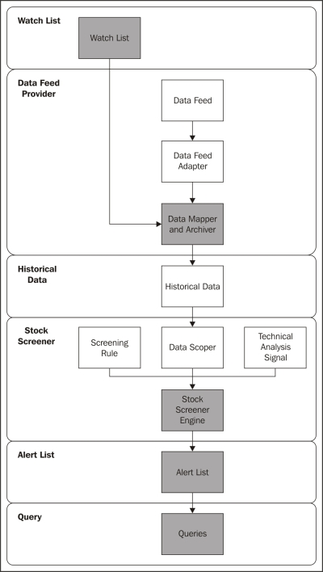
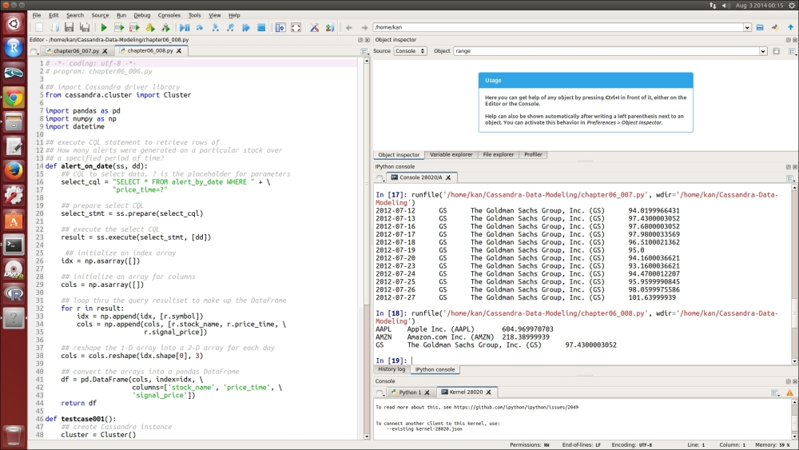

Lab 6. Enhancing a Version
---------------------------------------


Traditionally, changes are usually not welcomed and are avoided as much
as possible by a relational database developer. However, business
changes every day, especially in the present fast-paced era. The
delayed response to business changes of a system
using a relational database deteriorates the agility and even threatens
the survival of the enterprise. With the advancement of NoSQL and other
related technologies, we now have alternatives to embrace such business
changes.

By continuing with the enhancements of the Stock Screener Application
developed in lab 5,
*First-cut Design and Implementation*, the techniques of
how to evolve an existing Cassandra data model will be explained in
detail. Meanwhile, the techniques of modeling by query will be
demonstrated as well. The source code of the Stock Screener Application
will then be modified accordingly. By the end of this lab, a
complete technical analysis application on stocks will be developed. You
can use it as a foundation to quickly develop your own.


Evolving the data model
-----------------------------------------

The Stock Screener Application created in,
*First-cut Design and Implementation*, is good enough to
retrieve and analyze a single stock at one time.
However, scanning just a single stock looks very limited in practical
use. A slight improvement can be made here; it can handle a bunch of
stocks instead of one. This bunch of stocks will be stored as Watch List
in the Cassandra database.

Accordingly, the Stock Screener Application will be modified to analyze
the stocks in the Watch List, and therefore it will produce alerts for
each of the stocks being watched based on the same screening rule.

For the produced alerts, saving them in Cassandra will be beneficial for
backtesting trading strategies and continuous improvement of the Stock
Screener Application. They can be reviewed from time to time without
having to review them on the fly.


### Note

Backtesting is a jargon used to refer to testing a trading strategy,
investment strategy, or a predictive model using existing historical
data. It is also a special type of cross-validation applied to time
series data.
:::

In addition, when the number of the stocks in the
Watch List grows to a few hundred, it will be difficult for a user of
the Stock Screener Application to recall what the stocks are by simply
referring to their stock codes. Hence, it would be nice to have the name
of the stocks added to the produced alerts to make them more descriptive
and user-friendly.

Finally, we might have an interest in finding out
how many alerts were generated on a particular stock over a specified
period of time and how many alerts were generated on a particular date.
We will use CQL to write queries to answer these two questions. By doing
so, the modeling by query technique can be demonstrated.


### The enhancement approach


The enhancement approach consists of four change
requests in total. First, we will conduct changes in the data model and
then the code will be enhanced to provide the new
features. Afterwards, we will test run the enhanced Stock Screener
Application again. The parts of the Stock Screener Application that
require modifications are highlighted in the following figure.

It is remarkable that two new components are added
to the Stock Screener Application. The first component, **Watch
List**, governs **Data Mapper and
Archiver** to collect stock quote data of
those stocks in the Watch List from Yahoo! Finance. The second component
is  **Query**. It provides two Queries on
**Alert List** for backtesting purposes:





#### Watch List


**Watch List** is a very simple table that merely stores the stock code of its
constituents. It is rather intuitive for a relational database developer
to define the stock code as the primary key, isn't it? Nevertheless,
remember that in Cassandra, the primary key is used to determine the
node that stores the row. As Watch List is expected to not be a very
long list, it would be more appropriate to put all of its rows on the
same node for faster retrieval. But how can we do that?

We can create an additional column, say `watch_list_code` , for
this particular purpose. The new table is called
`watchlist` and will be created in the
`fenagocdma` keyspace. The CQL statement is shown in
`lab06_001.py`:


``` {.programlisting .language-markup}
# -*- coding: utf-8 -*-
# program: lab06_001.py

## import Cassandra driver library
from cassandra.cluster import Cluster

## function to create watchlist
def create_watchlist(ss):
    ## create watchlist table if not exists
    ss.execute('CREATE TABLE IF NOT EXISTS watchlist (' + \
               'watch_list_code varchar,' + \
               'symbol varchar,' + \
               'PRIMARY KEY (watch_list_code, symbol))')
    
    ## insert AAPL, AMZN, and GS into watchlist
    ss.execute("INSERT INTO watchlist (watch_list_code, " + \
               "symbol) VALUES ('WS01', 'AAPL')")
    ss.execute("INSERT INTO watchlist (watch_list_code, " + \
               "symbol) VALUES ('WS01', 'AMZN')")
    ss.execute("INSERT INTO watchlist (watch_list_code, " + \
               "symbol) VALUES ('WS01', 'GS')")

## create Cassandra instance
cluster = Cluster()

## establish Cassandra connection, using local default
session = cluster.connect()

## use fenagocdma keyspace
session.set_keyspace('fenagocdma')

## create watchlist table
create_watchlist(session)

## close Cassandra connection
cluster.shutdown()
```

The `create_watchlist` function creates the table. Note that
the `watchlist` table has a compound primary key made of `watch_list_code` and
`symbol`. A Watch List called `WS01` is also
created, which contains three stocks, `AAPL` ,
`AMZN` , and `GS`.


#### Alert List


In
*First-cut Design and Implementation*, **Alert
List** is very rudimentary. It is
produced by a Python program and enumerates the
date when the close price was above its 10-day SMA, that is, the signal
and the close price at that time. Note that there were no stock code and
stock name.

We will create a table called `alertlist` to store the alerts
with the code and name of the stock. The inclusion of the stock name is
to meet the requirement of making the Stock Screener Application more
user-friendly. Also, remember that joins are not allowed and
denormalization is really the best practice in Cassandra. This means
that we do not mind repeatedly storing (duplicating) the stock name in
the tables that will be queried. A rule of thumb is *one table for one
query*; as simple as that.

The `alertlist` table is created by the CQL statement, as
shown in `lab06_002.py`:


``` {.programlisting .language-markup}
# -*- coding: utf-8 -*-
# program: lab06_002.py

## import Cassandra driver library
from cassandra.cluster import Cluster

## function to create alertlist
def create_alertlist(ss):
    ## execute CQL statement to create alertlist table if not exists
    ss.execute('CREATE TABLE IF NOT EXISTS alertlist (' + \
               'symbol varchar,' + \
               'price_time timestamp,' + \
               'stock_name varchar,' + \
               'signal_price float,' + \
               'PRIMARY KEY (symbol, price_time))')

## create Cassandra instance
cluster = Cluster()

## establish Cassandra connection, using local default
session = cluster.connect()

## use fenagocdma keyspace
session.set_keyspace('fenagocdma')

## create alertlist table
create_alertlist(session)

## close Cassandra connection
cluster.shutdown()
```

The primary key is also a compound primary key that
consists of `symbol` and `price_time`.


#### Adding the descriptive stock name

Until now, the `fenagocdma` keyspace has
three tables, which are `alertlist` , `quote` , and
`watchlist`. To add the descriptive stock name, one can think
of only adding a column of stock name to `alertlist` only. As
seen in the previous section, this has been done. So, do we need to add
a column for `quote` and `watchlist`?

It is, in fact, a design decision that depends on whether these two
tables will be serving user queries. What a user query means is that the
table will be used to retrieve rows for a query raised by a user. If a
user wants to know the close price of Apple Inc. on June 30, 2014, it is
a user query. On the other hand, if the Stock Screener Application uses
a query to retrieve rows for its internal processing, it is not a user
query. Therefore, if we want `quote` and `watchlist`
to return rows for user queries, they need the stock name column;
otherwise, they do not need it.

The `watchlist` table is only for internal use by the current
design, and so it need not have the stock name column. Of course, if in
future, the Stock Screener Application allows a user to maintain Watch
List, the stock name should also be added to the `watchlist`
table.

However, for `quote` , it is a bit tricky. As the stock name
should be retrieved from the Data Feed Provider, which is Yahoo! Finance
in our case, the most suitable time to get it is when the corresponding
stock quote data is retrieved. Hence, a new column called
`stock_name` is added to `quote` , as shown in
`lab06_003.py`:


``` {.programlisting .language-markup}
# -*- coding: utf-8 -*-
# program: lab06_003.py

## import Cassandra driver library
from cassandra.cluster import Cluster

## function to add stock_name column
def add_stockname_to_quote(ss):
    ## add stock_name to quote
    ss.execute('ALTER TABLE quote ' + \
               'ADD stock_name varchar')

## create Cassandra instance
cluster = Cluster()

## establish Cassandra connection, using local default
session = cluster.connect()

## use fenagocdma keyspace
session.set_keyspace('fenagocdma')

## add stock_name column
add_stockname_to_quote(session)

## close Cassandra connection
cluster.shutdown()
```

It is quite self-explanatory. Here, we use the
`ALTER TABLE` statement to add the `stock_name`
column of the `varchar` data type to `quote`.


#### Queries on alerts


As previously, we
are interested in two questions:


-   How many alerts were generated on a stock over a specified period of
    time?

-   How many alerts were generated on a particular date?
:::

For the first question, `alertlist` is sufficient to provide
an answer. However, `alertlist` cannot answer the second
question because its primary key is composed of `symbol` and
`price_time`. We need to create another table specifically for
that question. This is an example of modeling by query.

Basically, the structure of the new table for the second question should
resemble the structure of `alertlist`. We give that table a name,
`alert_by_date` , and create it as shown in
`lab06_004.py`:


``` {.programlisting .language-markup}
# -*- coding: utf-8 -*-
# program: lab06_004.py

## import Cassandra driver library
from cassandra.cluster import Cluster

## function to create alert_by_date table
def create_alertbydate(ss):
    ## create alert_by_date table if not exists
    ss.execute('CREATE TABLE IF NOT EXISTS alert_by_date (' + \
               'symbol varchar,' + \
               'price_time timestamp,' + \
               'stock_name varchar,' + \
               'signal_price float,' + \
               'PRIMARY KEY (price_time, symbol))')

## create Cassandra instance
cluster = Cluster()

## establish Cassandra connection, using local default
session = cluster.connect()

## use fenagocdma keyspace
session.set_keyspace('fenagocdma')

## create alert_by_date table
create_alertbydate(session)

## close Cassandra connection
cluster.shutdown()
```

When compared to `alertlist` in `lab06_002.py` ,
`alert_by_date` only swaps the order of the columns in the
compound primary key. One might think that a secondary index can be
created on `alertlist` to achieve the same effect.
Nonetheless, in Cassandra, a secondary index cannot be created on
columns that are already engaged in the primary key. Always be aware of
this constraint.

We now finish the modifications on the data model. It is time for us to
enhance the application logic in the next section.


Enhancing the code
------------------------------------

Regarding the new requirements to be incorporated into the Stock Screener Application, Watch List
is created, and we will continue to implement the code for the remaining
changes in this section.


### Data Mapper and Archiver


Data Mapper and Archiver are components of the Data
Feed Provider module, and its source code file is
`lab05_005.py`. Most of the source code can be left
intact; we only need to add code to:


1.  Load Watch List for a Watch List code and retrieve data feed based
    on that

2.  Retrieve the name of the stocks and store it in the quote table
:::

The modified source code is shown in `lab06_005.py`:


``` {.programlisting .language-markup}
# -*- coding: utf-8 -*-
# program: lab06_005.py

## import Cassandra driver library
from cassandra.cluster import Cluster
from decimal import *

## web is the shorthand alias of pandas_datareader
import pandas_datareader as web
import datetime

## import BeautifulSoup and requests
from bs4 import BeautifulSoup
import requests

## function to insert historical data into table quote
## ss: Cassandra session
## sym: stock symbol
## d: standardized DataFrame containing historical data
## sn: stock name
def insert_quote(ss, sym, d, sn):
    ## CQL to insert data, ? is the placeholder for parameters
    insert_cql = "INSERT INTO quote (" + \
                 "symbol, price_time, open_price, high_price," + \
                 "low_price, close_price, volume, stock_name" + \
                 ") VALUES (?, ?, ?, ?, ?, ?, ?, ?)"
    ## prepare the insert CQL as it will run repeatedly
    insert_stmt = ss.prepare(insert_cql)

    ## set decimal places to 4 digits
    getcontext().prec = 4

    ## loop thru the DataFrame and insert records
    for index, row in d.iterrows():
        ss.execute(insert_stmt, \
                   [sym, index, \
                   Decimal(row['open_price']), \
                   Decimal(row['high_price']), \
                   Decimal(row['low_price']), \
                   Decimal(row['close_price']), \
                   Decimal(row['volume']), \
                   sn])
```

Here, we changed the `INSERT` statement
to store the stock name into `quote` in the
`insert_quote` function. We then add a function called
`load_watchlist`:


``` {.programlisting .language-markup}
## retrieve the historical daily stock quote from Yahoo! Finance
## Parameters
## sym: stock symbol
## sd: start date
## ed: end date
def collect_data(sym, sd, ed):
    ## data is a DataFrame holding the daily stock quote
    data = web.DataReader(sym, 'yahoo', sd, ed)
    return data

## transform received data into standardized format
## Parameter
## d: DataFrame containing Yahoo! Finance stock quote
def transform_yahoo(d):
    ## drop extra column 'Adj Close'
    d1 = d.drop(['Adj Close'], axis=1)

    ## standardize the column names
    ## rename index column to price_date
    d1.index.names=['price_date']

    ## rename the columns to match the respective columns
    d1 = d1.rename(columns={'Open':'open_price', \
                            'High':'high_price', \
                            'Low':'low_price', \
                            'Close':'close_price', \
                            'Volume':'volume'})
    return d1

## function to retrieve watchlist
## ss: Cassandra session
## ws: watchlist code
def load_watchlist(ss, ws):
    ## CQL to select data, ? is the placeholder for parameters
    select_cql = "SELECT symbol FROM watchlist " + \
                 "WHERE watch_list_code=?"

    ## prepare select CQL
    select_stmt = ss.prepare(select_cql)

    ## execute the select CQL
    result = ss.execute(select_stmt, [ws])

    ## initialize the stock array
    stw = []

    ## loop thru the query resultset to make up the DataFrame
    for r in result:
        stw.append(r.symbol)

    return stw
```

Here, the  new function, `load_watchlist` ,
submits a `SELECT` query on `watch_list` to retrieve
the stocks to be watched of a particular Watch List
code; it then returns a list of `symbol`:


``` {.programlisting .language-markup}
## function to retrieve stock name from Yahoo!Finance
## sym: stock symbol
def get_stock_name(sym):
  url = 'http://finance.yahoo.com/q/hp?s=' + sym + \
  '+Historical+Prices'
  r = requests.get(url)
  soup = BeautifulSoup(r.text)
  data = soup.findAll('h2')
  return data[2].text

def testcase001():
    ## create Cassandra instance
    cluster = Cluster()
    
    ## establish Cassandra connection, using local default
    session = cluster.connect('fenagocdma')
    
    start_date = datetime.datetime(2012, 1, 1)
    end_date = datetime.datetime(2014, 6, 28)
    
    ## load the watchlist
    stocks_watched = load_watchlist(session, "WS01")
    
    ## iterate the watchlist
    for symbol in stocks_watched:
        ## get stock name
        stock_name = get_stock_name(symbol)
    
        ## collect data
        data = collect_data(symbol, start_date, end_date)
    
        ## transform Yahoo! Finance data
        data = transform_yahoo(data)
    
        ## insert historical data
        insert_quote(session, symbol, data, stock_name)
    
    ## close Cassandra connection
    cluster.shutdown()

testcase001()
```

The change here is a new function named
`get_stock_name` , which sends a web service request to Yahoo!
Finance and extracts the name of the stock from the returned HTML page.
We use a Python package called `BeautifulSoup` to make the
extraction of an element from a HTML page very convenient. The
`get_stock_name` function then returns the stock name.


### Note

`BeautifulSoup` is a library designed for
quick turnaround projects such as screen scraping. It primarily parses
any text given to it and finds anything wanted through the tree
traversal of the parsed text. More information can be found at
<http://www.crummy.com/software/BeautifulSoup/>.
:::

A `for` loop is used to iterate through the Watch List to
retrieve the stock name and the stock quote data. In addition, as we
need to store the stock name in the `quote` table, the
`insert_quote` function accepts the stock name as a new
parameter and requires a little modification on the `INSERT`
statement and the `for` loop accordingly.

That is all about the changes on Data Mapper and Archiver.


#### Stock Screener Engine

We will use the  source code of Stock Screener
Engine in
*First-cut Design and Implementation* to include the
enhancements; to do so, we will perform the following:


1.  Similar to Data Mapper and Archiver, we will load Watch List for a
    Watch List code and scan for alerts on each stock.

2.  Retrieve stock quote data with the stock name column from the quote
    table.

3.  Save the alerts into `alertlist`.
:::

The modified source code is shown in `lab06_006.py`:


``` {.programlisting .language-markup}
# -*- coding: utf-8 -*-
# program: lab06_006.py

## import Cassandra driver library
from cassandra.cluster import Cluster

import pandas as pd
import numpy as np
import datetime

## import Cassandra BatchStatement library
from cassandra.query import BatchStatement
from decimal import *

## function to insert historical data into table quote
## ss: Cassandra session
## sym: stock symbol
## sd: start date
## ed: end date
## return a DataFrame of stock quote
def retrieve_data(ss, sym, sd, ed):
    ## CQL to select data, ? is the placeholder for parameters
    select_cql = "SELECT * FROM quote WHERE symbol=? " + \
                 "AND price_time >= ? AND price_time <= ?"

    ## prepare select CQL
    select_stmt = ss.prepare(select_cql)

    ## execute the select CQL
    result = ss.execute(select_stmt, [sym, sd, ed])

    ## initialize an index array
    idx = np.asarray([])

    ## initialize an array for columns
    cols = np.asarray([])

    ## loop thru the query resultset to make up the DataFrame
    for r in result:
        idx = np.append(idx, [r.price_time])
        cols = np.append(cols, [r.open_price, r.high_price, \
                         r.low_price, r.close_price, \
                         r.volume, r.stock_name])

    ## reshape the 1-D array into a 2-D array for each day
    cols = cols.reshape(idx.shape[0], 6)

    ## convert the arrays into a pandas DataFrame
    df = pd.DataFrame(cols, index=idx, \
                      columns=['open_price', 'high_price', \
                      'low_price', 'close_price', \
                      'volume', 'stock_name'])
    return df
```

As we have included the stock name in the query
resultset, we need to modify the `SELECT` statement in the
`retrieve_data` function:


``` {.programlisting .language-markup}
## function to compute a Simple Moving Average on a DataFrame
## d: DataFrame
## prd: period of SMA
## return a DataFrame with an additional column of SMA
def sma(d, prd):
    d['sma'] = pd.rolling_mean(d.close_price, prd)
    return d

## function to apply screening rule to generate buy signals
## screening rule, Close > 10-Day SMA
## d: DataFrame
## return a DataFrame containing buy signals
def signal_close_higher_than_sma10(d):
    return d[d.close_price > d.sma]

## function to retrieve watchlist
## ss: Cassandra session
## ws: watchlist code
def load_watchlist(ss, ws):
    ## CQL to select data, ? is the placeholder for parameters
    select_cql = "SELECT symbol FROM watchlist " + \
                 "WHERE watch_list_code=?"

    ## prepare select CQL
    select_stmt = ss.prepare(select_cql)

    ## execute the select CQL
    result = ss.execute(select_stmt, [ws])

    ## initialize the stock array
    stw = []

    ## loop thru the query resultset to make up the DataFrame
    for r in result:
        stw.append(r.symbol)

    return stw

## function to insert historical data into table quote
## ss: Cassandra session
## sym: stock symbol
## d: standardized DataFrame containing historical data
## sn: stock name
def insert_alert(ss, sym, sd, cp, sn):
    ## CQL to insert data, ? is the placeholder for parameters
    insert_cql1 = "INSERT INTO alertlist (" + \
                 "symbol, price_time, signal_price, stock_name" +\
                 ") VALUES (?, ?, ?, ?)"

    ## CQL to insert data, ? is the placeholder for parameters
    insert_cql2 = "INSERT INTO alert_by_date (" + \
                 "symbol, price_time, signal_price, stock_name" +\
                 ") VALUES (?, ?, ?, ?)"

    ## prepare the insert CQL as it will run repeatedly
    insert_stmt1 = ss.prepare(insert_cql1)
    insert_stmt2 = ss.prepare(insert_cql2)

    ## set decimal places to 4 digits
    getcontext().prec = 4

    ## begin a batch
    batch = BatchStatement()
    
    ## add insert statements into the batch
    batch.add(insert_stmt1, [sym, sd, cp, sn])
    batch.add(insert_stmt2, [sym, sd, cp, sn])
    
    ## execute the batch
    ss.execute(batch)

def testcase002():
    ## create Cassandra instance
    cluster = Cluster()
    
    ## establish Cassandra connection, using local default
    session = cluster.connect('fenagocdma')
    
    start_date = datetime.datetime(2012, 6, 28)
    end_date = datetime.datetime(2012, 7, 28)
    
    ## load the watch list
    stocks_watched = load_watchlist(session, "WS01")
    
    for symbol in stocks_watched:
        ## retrieve data
        data = retrieve_data(session, symbol, start_date, end_date)
        
        ## compute 10-Day SMA
        data = sma(data, 10)
        
        ## generate the buy-and-hold signals
        alerts = signal_close_higher_than_sma10(data)
        
        ## save the alert list
        for index, r in alerts.iterrows():
            insert_alert(session, symbol, index, \
                         Decimal(r['close_price']), \
                         r['stock_name'])
    
    ## close Cassandra connection
    cluster.shutdown()

testcase002()
```

At the bottom of `lab06_006.py` , the
`for` loop is responsible for iterating `watchlist`
loaded by the new `load_watchlist` function, which is the same
function as in `lab06_005.py` and does not require further
explanation. Another `for` loop inside saves the scanned
alerts into `alertlist` by calling the new
`insert_alert` function.

Before explaining the `insert_alert` function, let us jump to
the `retrieve_data` function at the top. The
`retrieve_data` function is modified to return the name of the
stock as well and hence the `cols` variable now contains six
columns. Scroll down a bit to `insert_alert`.

The `insert_alert` function, as its name suggests, saves the
alert into `alertlist` and `alert_by_date`. It has
two `INSERT` statements for these two tables, respectively.
The `INSERT` statements are almost
identical except for the name of the table. Obviously, they are
repeated, and this is what denormalization means. We also apply a new
feature of Cassandra 2.0 here, known as *batch*. A batch
combines multiple **data modification language**
(**DML**) statements into a single
logical, atomic operation. The Cassandra Python driver from DataStax
supports this feature by the `BatchStatement` package. We
create a batch by calling the `BatchStatement()` function,
then add the prepared `INSERT` statements into the batch, and
finally execute it. If either `INSERT` statement comes across
an error during commit, all DML statements in the batch will not be
executed. Therefore, it is analogous to a transaction in a relational
database.


#### Queries on Alerts


The last modification to the Stock Screener
Application is the enquiry functions on alerts that are useful for
backtesting and performance measurement. We write two queries to answer
the two questions, which are as follows:


-   How many alerts were generated on a stock over a specified period of
    time?

-   How many alerts were generated on a particular date?
:::

As we have used denormalization on the data model, it is very easy to
execute. For the first query, see `lab06_007.py`:


``` {.programlisting .language-markup}
# -*- coding: utf-8 -*-
# program: lab06_007.py

## import Cassandra driver library
from cassandra.cluster import Cluster

import pandas as pd
import numpy as np
import datetime

## execute CQL statement to retrieve rows of
## How many alerts were generated on a particular stock over
## a specified period of time?
def alert_over_daterange(ss, sym, sd, ed):
    ## CQL to select data, ? is the placeholder for parameters
    select_cql = "SELECT * FROM alertlist WHERE symbol=? " + \
                 "AND price_time >= ? AND price_time <= ?"

    ## prepare select CQL
    select_stmt = ss.prepare(select_cql)

    ## execute the select CQL
    result = ss.execute(select_stmt, [sym, sd, ed])

     ## initialize an index array
    idx = np.asarray([])

    ## initialize an array for columns
    cols = np.asarray([])

    ## loop thru the query resultset to make up the DataFrame
    for r in result:
        idx = np.append(idx, [r.price_time])
        cols = np.append(cols, [r.symbol, r.stock_name, \
                         r.signal_price])

    ## reshape the 1-D array into a 2-D array for each day
    cols = cols.reshape(idx.shape[0], 3)

    ## convert the arrays into a pandas DataFrame
    df = pd.DataFrame(cols, index=idx, \
                      columns=['symbol', 'stock_name', \
                      'signal_price'])
    return df

def testcase001():
    ## create Cassandra instance
    cluster = Cluster()
    
    ## establish Cassandra connection, using local default
    session = cluster.connect()
    
    ## use fenagocdma keyspace
    session.set_keyspace('fenagocdma')

    ## scan buy-and-hold signals for GS
    ## over 1 month since 28-Jun-2012
    symbol = 'GS'
    start_date = datetime.datetime(2012, 6, 28)
    end_date = datetime.datetime(2012, 7, 28)
    
    ## retrieve alerts
    alerts = alert_over_daterange(session, symbol, \
                                  start_date, end_date)
    
    for index, r in alerts.iterrows():
        print index.date(), '\t', \
            r['symbol'], '\t', \
            r['stock_name'], '\t', \
            r['signal_price']
    
    ## close Cassandra connection
    cluster.shutdown()

testcase001()
```

A function named `alert_over_daterange` is defined to retrieve
the rows relevant to the first question. Then it transforms the CQL
resultset to a pandas DataFrame.

Then we can come up with a query for the second
question with reference to the same logic in
`lab06_007.py`. The source code is shown in
`lab06_008.py`:


``` {.programlisting .language-markup}
# -*- coding: utf-8 -*-
# program: lab06_008.py

## import Cassandra driver library
from cassandra.cluster import Cluster

import pandas as pd
import numpy as np
import datetime

## execute CQL statement to retrieve rows of
## How many alerts were generated on a particular stock over
## a specified period of time?
def alert_on_date(ss, dd):
    ## CQL to select data, ? is the placeholder for parameters
    select_cql = "SELECT * FROM alert_by_date WHERE " + \
                 "price_time=?"

    ## prepare select CQL
    select_stmt = ss.prepare(select_cql)

    ## execute the select CQL
    result = ss.execute(select_stmt, [dd])

     ## initialize an index array
    idx = np.asarray([])

    ## initialize an array for columns
    cols = np.asarray([])

    ## loop thru the query resultset to make up the DataFrame
    for r in result:
        idx = np.append(idx, [r.symbol])
        cols = np.append(cols, [r.stock_name, r.price_time, \
                         r.signal_price])

    ## reshape the 1-D array into a 2-D array for each day
    cols = cols.reshape(idx.shape[0], 3)

    ## convert the arrays into a pandas DataFrame
    df = pd.DataFrame(cols, index=idx, \
                      columns=['stock_name', 'price_time', \
                      'signal_price'])
    return df

def testcase001():
    ## create Cassandra instance
    cluster = Cluster()
    
    ## establish Cassandra connection, using local default
    session = cluster.connect()
    
    ## use fenagocdma keyspace
    session.set_keyspace('fenagocdma')
    
    ## scan buy-and-hold signals for GS over 1 month since 28-Jun-2012
    on_date = datetime.datetime(2012, 7, 13)
    
    ## retrieve alerts
    alerts = alert_on_date(session, on_date)
    
    ## print out alerts
    for index, r in alerts.iterrows():
        print index, '\t', \
              r['stock_name'], '\t', \
              r['signal_price']
    
    ## close Cassandra connection
    cluster.shutdown()

testcase001()
```

Once again, denormalization is a friend of
Cassandra. It does not require a foreign key, referential integrity, or
table join.


Implementing system changes
---------------------------------------------


We can now the
changes to the system one-by-one:


1.  First we run `lab06_001.py` through to
    `lab06_004.py` in sequence to make changes to the data
    model.

2.  Then we execute `lab06_005.py` to retrieve stock quote
    data for the Watch List. It is worth mentioning that UPSERT is a
    very nice feature of Cassandra. We do not encounter a duplicate
    primary key while we insert the same row into a table. It simply
    updates the row if the row already exists or inserts the row
    otherwise. It makes the data manipulation logic neat and clean.

3.  Further, we run `chatper06_006.py` to store the alerts by
    scanning over the stock quote data of each stock in the Watch List.

4.  Finally, we execute
    `lab06_007.py` and `lab06_008.py` to
    enquire `alertlist` and
    `alert_by_date` , respectively. Their sample test results
    are shown in the following figure:

    
    


Summary
--------

This lab extends the Stock Screener Application by a number of
enhancements. We made changes to the data model to demonstrate the
modeling by query techniques and how denormalization can help us achieve
a high-performance application. We also tried the batch feature provided
by Cassandra 2.0.

Note that the source code in this lab is not housekept and can be
refactored somehow. However, because of the limit on the number of
pages, it is left as an exercise for the reader.

The Stock Screener Application is now running on a single node cluster.

In the next lab, we will delve into the considerations and
procedures of expanding it to a larger cluster, which is quite common in
real-life production systems.
