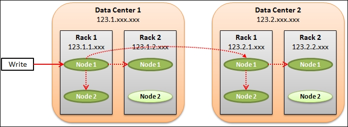
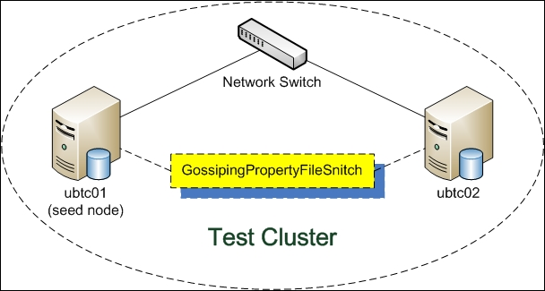
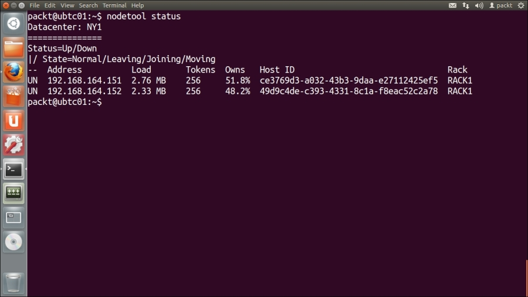
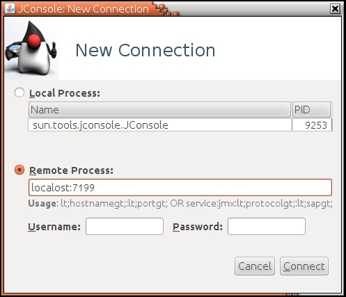
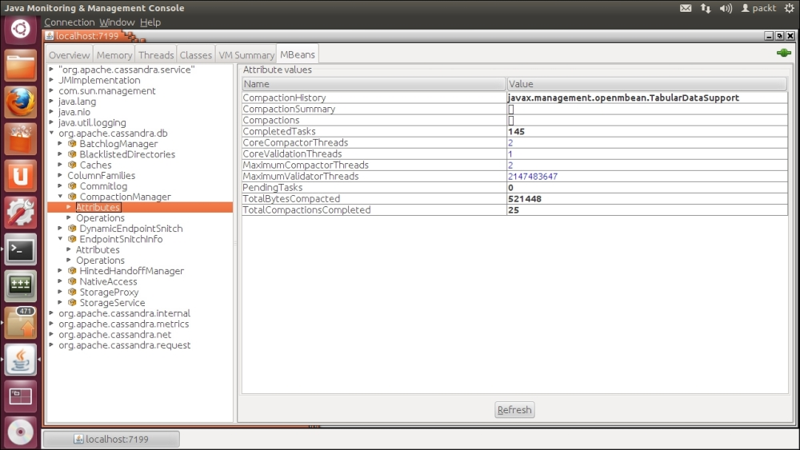
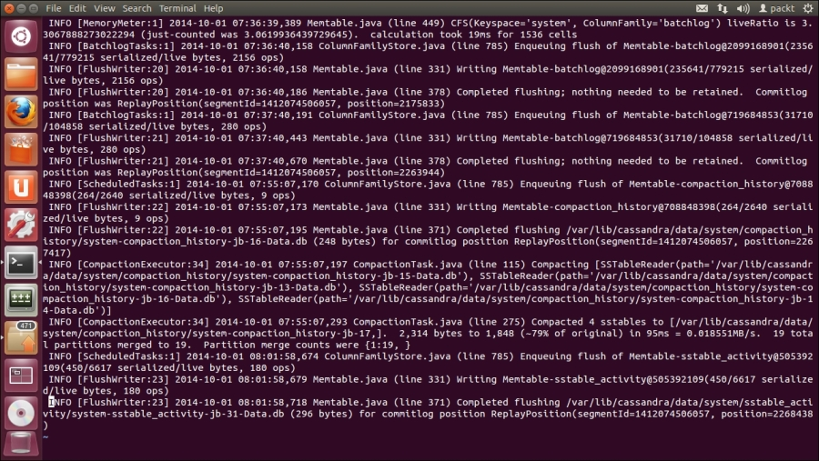
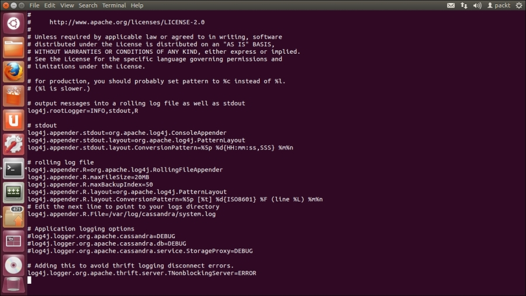
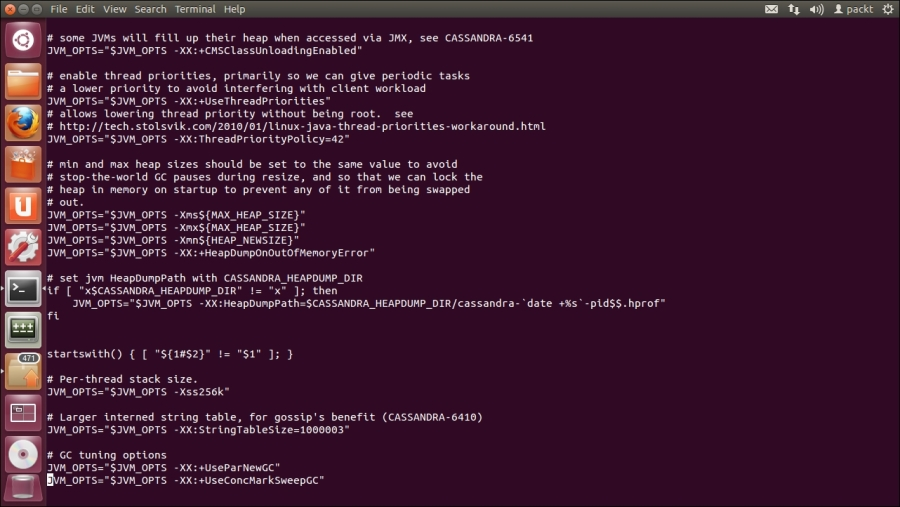
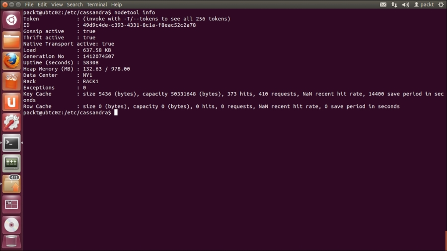

Chapter 7. Deployment and Monitoring
---------------------------------------------


We have explored the development of the Stock Screener Application in
previous chapters; it is now time to consider how to deploy it in the
production environment. In this chapter, we will discuss the most
important aspects of deploying a Cassandra database in production. These
aspects include the selection of an appropriate combination of
replication strategy, snitch, and replication factor to make up a
fault-tolerant, highly available cluster. Then we will demonstrate the
procedure to migrate our Cassandra development database of the Stock
Screener Application to a production database. However, cluster
maintenance is beyond the scope of this book.

Moreover, a live production system that continuously operates certainly
requires monitoring of its health status. We will cover the basic tools
and techniques of monitoring a Cassandra cluster, including the nodetool
utility, JMX and MBeans, and system log.

Finally, we will explore ways of boosting the performance of Cassandra
other than using the defaults. Actually, performance tuning can be made
at several levels, from the lowest hardware and system configuration to
the highest application coding techniques. We will focus on the **Java
Virtual Machine** (**JVM**)
level, because Cassandra heavily relies on its underlying performance.
In addition, we will touch on how to tune caches for a table.


Replication strategies
----------------------------------------


This section is about the data replication
configuration of a Cassandra cluster. It will cover replication
strategies, snitches, and the configuration of the cluster for the Stock
Screener Application.


### Data replication


Cassandra, by design, can work in a huge cluster
across multiple data centers all over the globe. In
such a distributed environment, network bandwidth and latency must be
critically considered in the architecture, and careful planning in
advance is required, otherwise it would lead to catastrophic
consequences. The most obvious issue is the time clock
synchronization---the genuine means of resolving transaction conflicts
that can threaten data integrity in the whole cluster. Cassandra
the underlying
operating system platform to provide the time clock synchronization
service. Furthermore, a node is highly likely to fail at some time and
the cluster must be resilient to this typical node failure. These issues
have to be thoroughly considered at the architecture level.

Cassandra adopts data replication to tackle these issues, based on the
idea of using space in exchange of time. It simply consumes more storage
space to make data replicas so as to minimize the complexities in
resolving the previously mentioned issues in a cluster.

Data replication is configured by the so-called replication factor in a
 **keyspace**. The replication factor
refers to the total number of copies of each row across the cluster. So
a replication factor of `1` (as seen in the examples in
previous chapters) means that there is only one copy of each row on one
node. For a replication factor of `2` , two copies of each row
are on two different nodes. Typically, a replication factor of
`3` is sufficient in most production scenarios.

All data replicas are equally important. There are neither master nor
slave replicas. So data replication does not have scalability issues.
The replication factor can be increased as more nodes are added.
However, the replication factor should not be set to exceed the number
of nodes in the cluster.

Another unique feature of Cassandra is its awareness of the physical
location of nodes in a cluster and their proximity to each other.
Cassandra can be configured to know the layout of the data centers and
racks by a correct IP address assignment scheme. This setting is known
as replication strategy and Cassandra provides two choices for us:
`SimpleStrategy` and `NetworkTopologyStrategy`.


### SimpleStrategy


`SimpleStrategy` is  used on a single
machine or on a cluster in a single data center. It
places the first replica on a node determined by the partitioner, and
then the additional replicas are placed on the next nodes in a clockwise
fashion without considering the data center and rack locations. Even
though this is the default replication strategy when creating a
keyspace, if we ever intend to have more than one data center, we should
use `NetworkTopologyStrategy` instead.


### NetworkTopologyStrategy


`NetworkTopologyStrategy` becomes
aware of the locations of data centers and racks by
understanding the IP addresses of the nodes in the cluster. It places
replicas in the same data center by the clockwise mechanism until the
first node in another rack is reached. It attempts to place replicas on
different racks because the nodes in the same rack often fail at the
same time due to power, network issues, air conditioning, and so on.

As mentioned, Cassandra knows the physical location from the IP
addresses of the nodes. The mapping of the IP addresses to the data
centers and racks is referred to as a 
**snitch**. Simply put, a snitch determines which data
centers and racks the nodes belong to. It optimizes read operations by
providing information about the network topology to Cassandra such that
read requests can be routed efficiently. It also affects how replicas
can be distributed in consideration of the physical location of data
centers and racks.

There are many types of snitches available for different scenarios and
each comes with its pros and cons. They are briefly described as
follows:


-   `SimpleSnitch`: This is used for
    single data center deployments only

-   `DynamicSnitch`: This monitors the
    performance of read operations from different
    replicas, and chooses the best replica based on historical
    performance

-   `RackInferringSnitch`: This 
    determines the location of the nodes
    by data center and rack corresponding to the IP addresses

-   `PropertyFileSntich`: This determines
    the locations of the nodes by data center and
    rack

-   `GossipingPropertyFileSnitch`: This 
    automatically updates all nodes using gossip
    when adding new nodes

-   `EC2Snitch`: This  is used 
    with Amazon EC2 in a single region

-   `EC2MultiRegionSnitch`: This is used
    with Amazon EC2 in multiple regions

-   `GoogleCloudSnitch`: This  is used
    with Google Cloud Platform across one or more
    regions

-   `CloudstackSnitch`: This is  used for
    Apache Cloudstack environments

### Note

**Snitch Architecture**

For more detailed information, please refer to the documentation made by
DataStax at
<http://www.datastax.com/documentation/cassandra/2.1/cassandra/architecture/architectureSnitchesAbout_c.html>.
:::

The following figure illustrates an example of a cluster of eight nodes
in four racks across two data centers using
`RackInferringSnitch` and a replication factor of three per
data center:





### Tip

All nodes in the cluster must use the same snitch setting.
:::

Let us look at the IP address assignment in **Data Center 1**
first. The IP addresses are grouped and assigned in a top-down fashion.
All the nodes in **Data Center 1** are in the same
**123.1.0.0** subnet. For those nodes in **Rack
1**, they are in the same **123.1.1.0** subnet.
Hence, **Node 1** in **Rack 1** is assigned an IP
address of **123.1.1.1** and **Node 2** in **Rack
1** is **123.1.1.2**. The same rule applies to
**Rack 2** such that the IP addresses of **Node
1** and **Node 2** in **Rack 2** are
**123.1.2.1** and **123.1.2.2**, respectively. For
**Data Center 2**, we just change the subnet of the data
center to **123.2.0.0** and the racks and nodes in **Data
Center 2** are then changed similarly.

The `RackInferringSnitch` deserves a more
detailed explanation. It assumes that the network topology is known by
properly assigned IP addresses based on the following rule:

*IP address = \<arbitrary octet\>.\<data center octet\>.\<rack
octet\>.\<node octet\>*

The formula for IP address assignment is shown in the previous
paragraph. With this very structured assignment of IP addresses,
Cassandra can understand the physical location of all nodes in the
cluster.

Another thing that we need to understand is the replication factor of
the three replicas that are shown in the previous figure. For a cluster
with `NetworkToplogyStrategy` , the replication factor is set
on a per data center basis. So in our example, three replicas are placed
in **Data Center 1** as illustrated by the dotted arrows in
the previous diagram. **Data Center 2** is another data
center that must have three replicas. Hence, there are six replicas in
total across the cluster.

We will not go through every combination of the replication factor,
snitch and replication strategy here, but we should now understand the
foundation of how Cassandra makes use of them to flexibly deal with
different cluster scenarios in real-life production.


### Setting up the cluster for Stock Screener Application


Let us return to the Stock Screener Application.
The cluster it runs on ,
*Enhancing a Version*, is a single-node cluster. In
this section, we will set up a cluster of two nodes
that can be used in small-scale production. We will also migrate the
existing data in the development database to the new fresh production
cluster. It should be noted that for quorum reads/writes, it's usually
best practice to use an odd number of nodes.


#### System and network configuration


The steps of installation and setup of the
operating system and network configuration are assumed to be done.
Moreover, both nodes should have Cassandra freshly installed. The system
configuration of the two nodes is identical and shown as follows:


-   OS: Ubuntu 12.04 LTS 64-bit

-   Processor: Intel Core i7-4771 CPU \@3.50GHz x 2

-   Memory: 2 GB

-   Disk: 20 GB
:::


#### Global settings


The  **Test
Cluster**, in which both the
**ubtc01** and **ubtc02** nodes are in the same rack, `RACK1` , and in the
same data center, `NY1`. The logical architecture of the
cluster to be set up is depicted in the following diagram:




In order to configure a Cassandra cluster, we need to modify a few
properties in the main configuration file, `cassandra.yaml` ,
for Cassandra. Depending on the installation method of Cassandra,
`cassandra.yaml` is located in different directories:


-   Package installation: `/etc/cassandra/`

-   Tarball installation: `<install_location>/conf/`
:::

The first thing to do is to set the properties in
`cassandra.yaml` for each node. As the system configuration of
both nodes is the same, the following modification on
`cassandra.yaml` settings is identical to them:


``` {.programlisting .language-markup}
-seeds: ubtc01
listen_address:
rpc_address: 0.0.0.0
endpoint_snitch: GossipingPropertyFileSnitch
auto_bootstrap: false
```
:::

The reason for using `GossipingPropertyFileSnitch` is that we
want the Cassandra cluster to automatically update all nodes with the
gossip protocol when adding a new node.

Apart from `cassandra.yaml` , we also need to modify the data
center and rack properties in `cassandra-rackdc.properties` in
the same location as `cassandra.yaml`. In our case, the data
center is `NY1` and the rack is `RACK1` , as shown in
the following code:


``` {.programlisting .language-markup}
dc=NY1
rack=RACK1
```
:::


#### Configuration procedure


The configuration procedure of the cluster (refer
to the following bash shell scripts: `setup_ubtc01.sh` and
`setup_ubtc02.sh`) is enumerated as follows:


1.  Stop Cassandra service:


    ``` {.programlisting .language-markup}
    ubtc01:~$ sudo service cassandra stop
    ubtc02:~$ sudo service cassandra stop
    ```
    :::

2.  Remove the system keyspace:


    ``` {.programlisting .language-markup}
    ubtc01:~$ sudo rm -rf /var/lib/cassandra/data/system/*
    ubtc02:~$ sudo rm -rf /var/lib/cassandra/data/system/*
    ```
    :::

3.  Modify `cassandra.yaml` and
    `cassandra-rackdc.properties` in both nodes based on the
    global settings as specified in the previous section

4.  Start the seed node `ubtc01` first:


    ``` {.programlisting .language-markup}
    ubtc01:~$ sudo service cassandra start
    ```
    :::

5.  Then start `ubtc02`:


    ``` {.programlisting .language-markup}
    ubtc02:~$ sudo service cassandra start
    ```
    :::

6.  Wait for a minute and check if `ubtc01` and
    `ubtc02` are both up and running:


    ``` {.programlisting .language-markup}
    ubtc01:~$ nodetool status
    ```
    :::
:::

A successful result of setting up the cluster
should resemble something similar to the following screenshot, showing
that both nodes are up and running:





#### Legacy data migration procedure


We now have the cluster ready but it is empty. We
can simply rerun the Stock Screener Application to download and fill in
the production database again. Alternatively, we can migrate the
historical prices collected in the development single-node cluster to
this production cluster. In the case of the latter approach, the
following procedure can help us ease the  data
migration task:


1.  Take a snapshot of the `packcdma` keyspace in the
    development database (ubuntu is the hostname of the development
    machine):


    ``` {.programlisting .language-markup}
    ubuntu:~$ nodetool snapshot fenagocdma
    ```
    :::

2.  Record the snapshot directory, in this example,
    **1412082842986**

3.  To play it safe, copy all SSTables under the snapshot directory to a
    temporary location, say `~/temp/`:


    ``` {.programlisting .language-markup}
    ubuntu:~$ mkdir ~/temp/
    ubuntu:~$ mkdir ~/temp/fenagocdma/
    ubuntu:~$ mkdir ~/temp/fenagocdma/alert_by_date/
    ubuntu:~$ mkdir ~/temp/fenagocdma/alertlist/
    ubuntu:~$ mkdir ~/temp/fenagocdma/quote/
    ubuntu:~$ mkdir ~/temp/fenagocdma/watchlist/
    ubuntu:~$ sudo cp -p /var/lib/cassandra/data/fenagocdma/alert_by_date/snapshots/1412082842986/* ~/temp/fenagocdma/alert_by_date/
    ubuntu:~$ sudo cp -p /var/lib/cassandra/data/fenagocdma/alertlist/snapshots/1412082842986/* ~/temp/fenagocdma/alertlist/
    ubuntu:~$ sudo cp -p /var/lib/cassandra/data/fenagocdma/quote/snapshots/1412082842986/* ~/temp/fenagocdma/quote/
    ubuntu:~$ sudo cp -p /var/lib/cassandra/data/fenagocdma/watchlist/snapshots/1412082842986/* ~/temp/fenagocdma/watchlist/
    ```
    :::

4.  Open cqlsh to connect to `ubtc01` and create a keyspace
    with the appropriate replication strategy in the production cluster:


    ``` {.programlisting .language-markup}
    ubuntu:~$ cqlsh ubtc01
    cqlsh> CREATE KEYSPACE fenagocdma WITH replication = {'class': 'NetworkTopologyStrategy',  'NY1': '2'};
    ```
    :::

5.  Create the `alert_by_date` , `alertlist` ,
    `quote` , and `watchlist` tables:


    ``` {.programlisting .language-markup}
    cqlsh> CREATE TABLE fenagocdma.alert_by_date (
      price_time timestamp,
      symbol varchar,
      signal_price float,
      stock_name varchar,
      PRIMARY KEY (price_time, symbol));
    cqlsh> CREATE TABLE fenagocdma.alertlist (
      symbol varchar,
      price_time timestamp,
      signal_price float,
      stock_name varchar,
      PRIMARY KEY (symbol, price_time));
    cqlsh> CREATE TABLE fenagocdma.quote (
      symbol varchar,
      price_time timestamp,
      close_price float,
      high_price float,
      low_price float,
      open_price float,
      stock_name varchar,
      volume double,
      PRIMARY KEY (symbol, price_time));
    cqlsh> CREATE TABLE fenagocdma.watchlist (
      watch_list_code varchar,
      symbol varchar,
      PRIMARY KEY (watch_list_code, symbol));
    ```
    :::

6.  Load the SSTables back to the production
    cluster using the `sstableloader` utility:


    ``` {.programlisting .language-markup}
    ubuntu:~$ cd ~/temp
    ubuntu:~/temp$ sstableloader -d ubtc01 fenagocdma/alert_by_date
    ubuntu:~/temp$ sstableloader -d ubtc01 fenagocdma/alertlist
    ubuntu:~/temp$ sstableloader -d ubtc01 fenagocdma/quote
    ubuntu:~/temp$ sstableloader -d ubtc01 fenagocdma/watchlist
    ```
    :::

7.  Check the legacy data in the production database on
    `ubtc02`:


    ``` {.programlisting .language-markup}
    cqlsh> select * from fenagocdma.alert_by_date;
    cqlsh> select * from fenagocdma.alertlist;
    cqlsh> select * from fenagocdma.quote;
    cqlsh> select * from fenagocdma.watchlist;
    ```
    :::
:::

Although the previous steps look complicated, it is
not difficult to understand what they want to achieve. It should be
noted that we have set the replication factor per data center as
`2` to provide data redundancy on both nodes, as shown in the
`CREATE KEYSPACE` statement. The replication factor can be
changed in future if needed.


#### Deploying the Stock Screener Application


As we have set up the production cluster and moved
the legacy data into it, it is time to deploy the Stock Screener
Application. The only thing needed to modify is the code to establish
Cassandra connection to the production cluster. This is very easy to do
with Python. The code in `chapter06_006.py` is modified to
work with the production cluster as `chapter07_001.py`. A new
test case named `testcase003()` is created to replace
`testcase002()`. To save pages, the complete source code of
`chapter07_001.py` is not shown here; only the
`testcase003()` function is depicted as follows:


``` {.programlisting .language-markup}
# -*- coding: utf-8 -*-
# program: chapter07_001.py

# other functions are not shown for brevity

def testcase003():
    ## create Cassandra instance with multiple nodes
    cluster = Cluster(['ubtc01', 'ubtc02'])
    
    ## establish Cassandra connection, using local default
    session = cluster.connect('fenagocdma')
    
    start_date = datetime.datetime(2012, 6, 28)
    end_date = datetime.datetime(2013, 9, 28)
    
    ## load the watch list
    stocks_watched = load_watchlist(session, "WS01")
    
    for symbol in stocks_watched:
        ## retrieve data
        data = retrieve_data(session, symbol, start_date, end_date)
        
        ## compute 10-Day SMA
        data = sma(data, 10)
        
        ## generate the buy-and-hold signals
        alerts = signal_close_higher_than_sma10(data)
        
        ## save the alert list
        for index, r in alerts.iterrows():
            insert_alert(session, symbol, index, \
                         Decimal(r['close_price']), \
                         r['stock_name'])
    
    ## close Cassandra connection
    cluster.shutdown()

testcase003()
```
:::

The cluster connection code right at the beginning
of the `testcase003()` function is passed with an array of the
nodes to be connected (`ubtc01` and `ubtc02`). Here
we adopted the default `RoundRobinPolicy` as the connection
load balancing policy. It is used to decide how to distribute requests
among all possible coordinator nodes in the cluster. There are many
other options which are described in the driver API documentation.


### Note

**Cassandra Driver 2.1 Documentation**

For the complete API documentation of the Python
Driver 2.1 for Apache Cassandra, you can refer to
<http://datastax.github.io/python-driver/api/index.html>.


Monitoring
----------------------------


As the  application system goes live, we need to
monitor its health day-by-day. Cassandra provides a number of tools for
this purpose. We will introduce some of them with pragmatic
recommendations. It is remarkable that each operating system also
provides a bunch of tools and utilities for
monitoring, for example, `top` , `df` , `du`
on Linux and Task Manager on Windows. However, they are beyond the scope
of this book.


### Nodetool


The  utility should
not be new to us. It is a command-line interface used to monitor
Cassandra and perform routine database operations. It includes the most
important metrics for tables, server, and compaction statistics, and
other useful commands for administration.

Here are the most commonly used `nodetool` options:


-   `status`: This  provides a concise
    summary of the cluster, such as the state, load, and IDs

-   `netstats`: This gives the network
    information for a node, focusing on read repair operations

-   `info`: This gives valuable node
    information including token, on disk load, uptime, Java heap memory
    usage, key cache, and row cache

-   `tpstats`: This provides statistics
    about the number of active, pending, and completed tasks for each
    stage of Cassandra operations by thread pool

-   `cfstats`: This gets the statistics
    about one or more tables, such as read-and-write counts and
    latencies, metrics about SSTable, memtable, bloom filter, and
    compaction.

### Note

A detailed documentation of nodetool can be
referred to at
<http://www.datastax.com/documentation/cassandra/2.0/cassandra/tools/toolsNodetool_r.html>.
:::


### JMX and MBeans


Cassandra written in the
Java language and so it natively supports **Java
Management Extensions** (**JMX**). We may use
JConsole, a JMX-compliant tool, to monitor
Cassandra.


### Note

**JConsole**

JConsole is included with Sun JDK 5.0 and higher
versions. However, it consumes a significant amount of system resources.
It is recommended that you run it on a remote machine rather than on the
same host as a Cassandra node.
:::

We can launch JConsole by typing
`jconsole` in a terminal. Assuming that we want to monitor the
local node, when the **New Connection** dialog box pops up,
we type `localhost:7199` (`7199` is the port number
of JMX) in the **Remote Process** textbox, as depicted in the
following screenshot:




After having connected to the local Cassandra instance, we will see a
well-organized GUI showing six separate tabs placed horizontally on the
top, as seen in the following screenshot:




The tabs of the GUI are explained as follows:


-   **Overview**: This displays overview information about
    the JVM and monitored values

-   **Memory**: This displays information about heap and
    non-heap memory usage and garbage collection metrics

-   **Threads**: This displays information about thread use

-   **Classes**: This displays information about class
    loading

-   **VM Summary**: This displays information about the JVM

-   **MBeans**: This displays information about specific
    Cassandra metrics and operations
:::

Furthermore, Cassandra provides five MBeans for
JConsole. They are briefly introduced as follows:


-   `org.apache.cassandra.db`: This
    includes caching, table metrics, and compaction

-   `org.apache.cassandra.internal`: These
    are internal server operations such as gossip and hinted
    handoff

-   `org.apache.cassandra.metrics`: These
    are various metrics of the Cassandra instance such as cache and
    compaction

-   `org.apache.cassandra.net`: This has
    Inter-node communication including FailureDetector, MessagingService
    and StreamingService

-   `org.apache.cassandra.request`: These
    include tasks related to read, write, and replication operations

### Note

**MBeans**

An **Managed Bean** (**MBean**) is a Java object that represents a manageable resource such as
an application, a service, a component, or a device running in the JVM.
It can be used to collect statistics on concerns such as performance,
resource usage, or problems, for getting and setting application
configurations or properties, and notifying events like faults or state
changes.
:::


### The system log


The most  yet the
most powerful, monitoring tool is Cassandra's system log. The default
location of the system log is named `system.log` under
`/var/log/cassandra/`. It is simply a text file and can be
viewed or edited by any text editor. The following screenshot shows an
extract of `system.log`:




This piece log looks long
and weird. However, if you are a Java developer and you are familiar
with the standard log library, Log4j, it is pretty straightforward. The
beauty of Log4j is the provision of different log levels for us to
control the granularity of the log statements to be recorded in
`system.log`. As shown in the previous figure, the first word
of each line is `INFO` , meaning that the log statement is a
piece of information. Other log level choices include `FATAL` ,
`ERROR` , `WARN` , `DEBUG` , and
`TRACE` , from the least verbose to the most verbose.

The system log is very valuable in troubleshooting problems as well. We
may increase the log level to `DEBUG` or `TRACE` for
troubleshooting. However, running a production Cassandra cluster in the
`DEBUG` or `TRACE` mode will degrade its performance
significantly. We must use them with great care.

We can change the standard log level in Cassandra by adjusting the
`log4j.rootLogger` property in
`log4j-server.properties` in the Cassandra configuration
directory. The following screenshot shows the content of
`log4j-server.properties` in ubtc02:




It is important to mention that
`system.log` and `log4j-server.properties` are only
responsible for a single node. For a cluster of two nodes, we
will have two `system.log` and two
`log4j-server.properties` on the respective nodes.


Performance tuning
------------------------------------


Performance tuning is a large and complex topic
that in itself can be a whole course. We can only scratch the surface of
it in this short section. Similar to monitoring in the last section,
operating system-specific performance tuning techniques are beyond the
scope of this book.


### Java virtual machine


Based on the information given by the monitoring
tools and the system log, we can discover
opportunities for performance tuning. The first things we usually watch
are the Java heap memory and garbage collection. JVM's configuration
settings are controlled in the environment settings
file for Cassandra, `cassandra-env.sh` , located in
`/etc/cassandra/`. An example is shown in the following
screenshot:




Basically, it already has the boilerplate options
calculated to be optimized for the host system. It is also accompanied
with explanation for us to tweak specific JVM parameters and the startup
options of a Cassandra instance when we experience real issues;
otherwise, these boilerplate options should not be altered.


### Note

A detailed documentation on how to tune JVM for
Cassandra can be found at
<http://www.datastax.com/documentation/cassandra/2.0/cassandra/operations/ops_tune_jvm_c.html>.
:::


### Caching


Another we should pay
attention to is caching. Cassandra includes integrated caching and
distributes cache data around the cluster. For a cache specific to a
table, we will focus on the partition key cache and the row cache.


#### Partition key cache


The partition key cache, or key cache for short, is a cache of the partition index for a
table. Using the key cache saves processor time and memory. However,
enabling just the key cache makes the disk activity actually read the
requested data rows.


#### Row cache


The  is similar to a
traditional cache. When a row is accessed, the entire row is pulled into
memory, merging from multiple SSTables when required, and cached. This
prevents Cassandra from retrieving that row using disk I/O again, which
can tremendously improve read performance.

When both row cache and partition key cache are configured, the row
cache returns results whenever possible. In the event of a row cache
miss, the partition key cache might still provide a hit that makes the
disk seek much more efficient.

However, there is one caveat. Cassandra caches all the rows of a
partition when reading that partition. So if the partition is large or
only a small portion of the partition is read every time, the row cache
might not be beneficial. It is very easy to be misused and consequently
the JVM will be exhausted, causing Cassandra to fail. That is why the
row cache is disabled by default.


### Note

We usually enable either the key or row cache for a table, not both at
the same time.
:::


#### Monitoring cache


Either the `nodetool info` command or JMX MBeans can provide assistance in monitoring
cache. We should make changes to cache options in small, incremental
adjustments, and then monitor the effects of each change using the
nodetool utility. The last two lines of output of the
`nodetool info` command, as seen in the following figure,
contain the `Row Cache` and `Key Cache` metrics of
`ubtc02`:




In the of high memory
consumption, we can consider tuning data caches.


#### Enabling/disabling cache


We the  CQL to enable or disable caching by altering the cache
property of a table. For instance, we use the `ALTER TABLE`
statement to enable the row cache for `watchlist`:


``` {.programlisting .language-markup}
ALTER TABLE watchlist WITH caching=''ROWS_ONLY'';
```
:::

Other available table caching options include
`ALL` , `KEYS_ONLY` and `NONE`. They are
quite self-explanatory and we do not go through each of them here.


### Note

Further information about data caching can be found
at
<http://www.datastax.com/documentation/cassandra/2.0/cassandra/operations/ops_configuring_caches_c.html>.


Summary
-------------------------

This chapter highlights the most important aspects of deploying a
Cassandra cluster into the production environment. Cassandra can be
taught to understand the physical location of the nodes in the cluster
in order to intelligently manage its availability, scalability and
performance. We deployed the Stock Screener Application to the
production environment, though the scale is small. It is also valuable
for us to learn how to migrate legacy data from a non-production
environment.

We then learned the basics of monitoring and performance tuning which
are a must for a live running system. If you have experience in
deploying other database and system, you may well appreciate the
neatness and simplicity of Cassandra.

In the next chapter, we will have a look at the supplementary
information pertinent to application design and development. We will
also summarize of the essence of each chapter.
